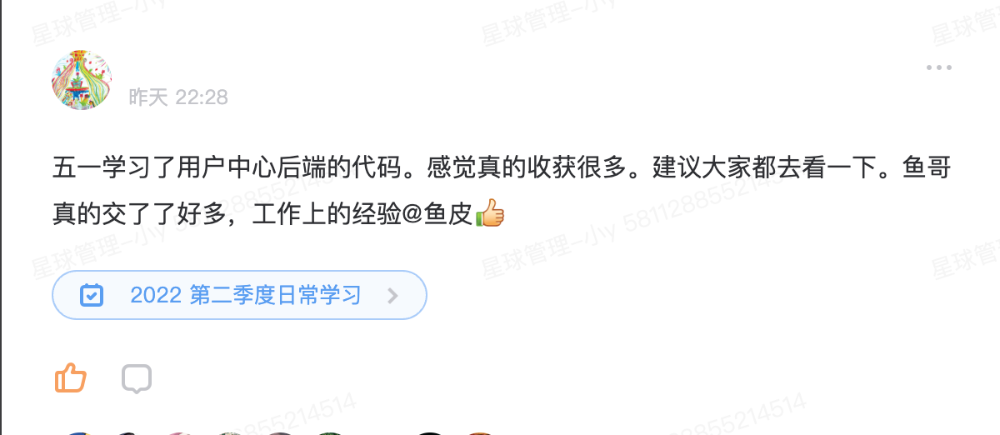

# 用户中心系统（User Center）

一个完整的用户中心系统，包含前后端实现，提供用户注册、登录、查询等基本功能。

## 项目结构

本仓库包含两个主要部分：

- `user-center-backend-master/`: 基于Spring Boot的后端实现
- `user-center-frontend-master/`: 基于React和Ant Design Pro的前端实现

## 技术栈

### 后端
- Java + Spring Boot + MyBatis Plus
- MySQL数据库
- RESTful API

### 前端
- React
- Ant Design Pro
- TypeScript
- Umi框架

## 快速开始

### 后端启动
```bash
# 进入后端目录
cd user-center-backend-master

# 编译项目
mvn clean package

# 启动应用
java -jar target/user-center-0.0.1-SNAPSHOT.jar
```

### 前端启动
```bash
# 进入前端目录
cd user-center-frontend-master

# 安装依赖
npm install

# 启动开发服务器
npm start
```

## 详细文档

- [后端文档](./user-center-backend-master/README.md)
- [前端文档](./user-center-frontend-master/README.md)

## 系统预览



## 部署方式

支持多种部署方式：
- 传统部署（Nginx + Spring Boot）
- Docker容器化
- 云平台部署

## 许可证

[MIT](./user-center-frontend-master/LICENSE) 